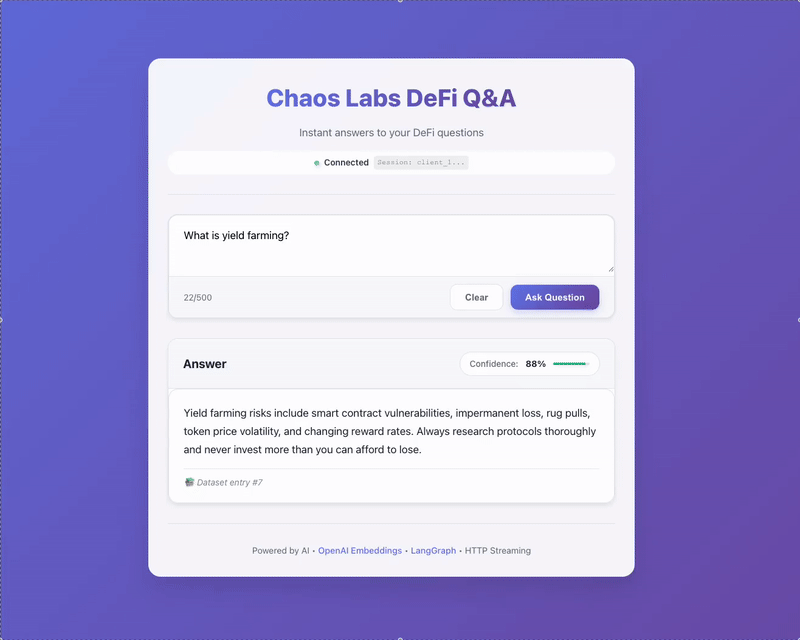
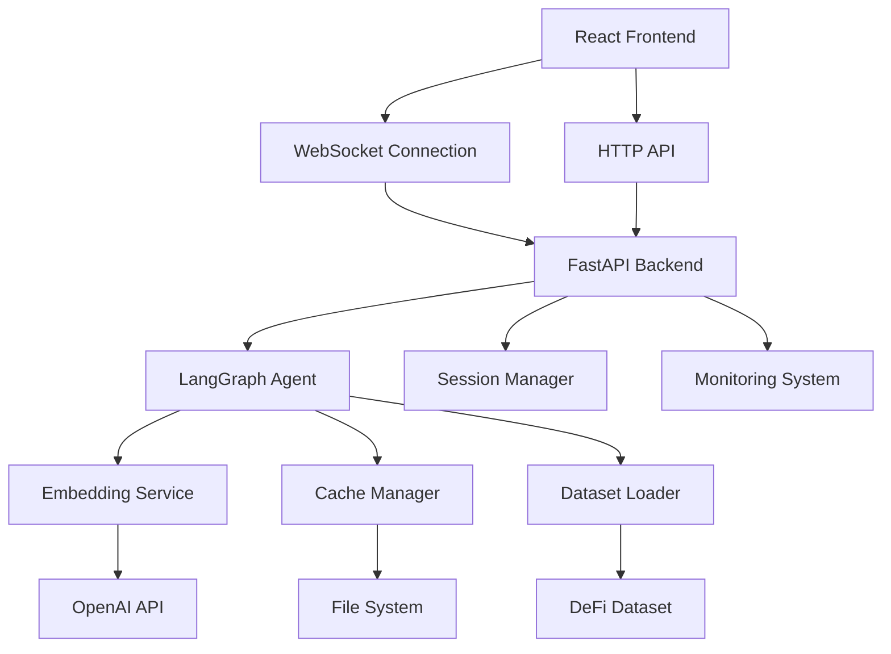

# DeFi Q&A Bot 🤖💰

A modern, AI-powered question-answering system specialized in Decentralized Finance (DeFi) topics. Built with **LangGraph orchestration**, **FastAPI**, and **React**, featuring real-time streaming responses and advanced semantic search capabilities.



You can try the live app [here](https://defi-qa-frontend.fly.dev/) (you might wait a while for app loading)

## 🚀 Features

### Core Capabilities

- **🧠 Intelligent Q&A**: Semantic search over a curated DeFi knowledge base
- **⚡ Real-time Streaming**: Word-by-word response streaming via WebSocket
- **🔍 High Accuracy**: OpenAI embeddings with similarity-based retrieval
- **📊 Confidence Scoring**: Each answer includes a confidence percentage
- **🎯 DeFi Specialized**: Covers lending, DEXs, yield farming, staking, and more

### Technical Features

- **🌐 Concurrent Handling**: Support for multiple simultaneous users
- **🔄 Session Management**: Isolated user sessions with automatic cleanup
- **📈 Monitoring & Metrics**: Comprehensive logging and Prometheus metrics
- **🛡️ Error Resilience**: Robust error handling with user-friendly messages
- **🚀 Production Ready**: Docker containerization and cloud deployment configs
- **⚡ Rate Limiting**: Configurable request rate limiting for API protection

## 📋 Quick Start

### Prerequisites

- **Python 3.11+**
- **Node.js 18+**
- **OpenAI API Key**

### 1. Clone & Setup

```bash
git clone https://github.com/yourusername/Chat_bot.git
cd Chat_bot

# Backend setup
cd backend
python -m venv env
source env/bin/activate  # On Windows: env\Scripts\activate
pip install -r requirements.txt

# Frontend setup
cd ../frontend
npm install
```

### 2. Environment Configuration

Create a `.env` file in the backend directory:

```bash
cp backend/environment_template.txt backend/.env
```

Edit `.env` with your settings:

```env
OPENAI_API_KEY=your_openai_api_key_here
ENVIRONMENT=development
HOST=127.0.0.1
PORT=8000
```

### 3. Start the Application

```bash
# Terminal 1: Start Backend
cd backend
python -m uvicorn main:app --reload

# Terminal 2: Start Frontend
cd frontend
npm start
```

### 4. Access the Application

- **Frontend**: http://localhost:3000
- **API Documentation**: http://localhost:8000/docs
- **Monitoring Dashboard**: http://localhost:8000/dashboard

## 🏗️ Architecture Overview

### System Components



## 🎯 Usage

### Web Interface

1. **Ask Questions**: Type DeFi-related questions in the input field
2. **Real-time Responses**: Watch answers stream in word-by-word
3. **Confidence Scores**: See how confident the AI is in each answer
4. **Connection Status**: Monitor your WebSocket connection status

### Example Questions

```
• "What is impermanent loss in liquidity provision?"
• "How does Compound's interest rate model work?"
• "What are the risks of yield farming?"
• "How do flash loans work on Aave?"
• "What is the difference between APR and APY in DeFi?"
```

## 🐳 Docker Deployment

### Quick Docker Setup

```bash
# Build and run with Docker
cd backend
docker build -t defi-qa-bot .
docker run -p 8000:8000 --env-file .env defi-qa-bot
```

### Docker Compose (Full Stack)

```bash
# Copy environment template
cp docker.env.example .env
# Edit .env with your OPENAI_API_KEY

# Start all services
docker-compose up --build -d

# Access application
# Frontend: http://localhost
# Backend: http://localhost:8000
```

## 🚀 Cloud Deployment

The application supports deployment to multiple cloud platforms:

| Platform          | Configuration File | Quick Deploy             |
| ----------------- | ------------------ | ------------------------ |
| **Heroku**  | `Procfile`       | `git push heroku main` |
| **Railway** | `railway.toml`   | Connect GitHub repo      |
| **Render**  | `render.yaml`    | Blueprint deployment     |
| **Vercel**  | `vercel.json`    | `vercel deploy`        |

### Environment Variables for Production

```env
OPENAI_API_KEY=your-openai-key
ENVIRONMENT=production
DEBUG=false
ALLOWED_ORIGINS=https://your-domain.com
```

## 🛠️ Development

### Project Structure

```
Chat_bot/
├── backend/                 # FastAPI backend (see backend/README.md)
│   ├── main.py             # Application entry point
│   ├── agents/             # LangGraph agents
│   ├── services/           # Business logic
│   ├── infrastructure/     # Monitoring, logging
│   └── tests/             # Test suite
├── frontend/               # React frontend (see frontend/README.md)
│   └── src/
├── data/                  # DeFi Q&A dataset
└── cache/                # Cached embeddings
```

### Running Tests

```bash
# Backend tests
cd backend
python -m pytest tests/ -v

# Integration tests
python test_integration.py
python test_api.py
```

### Development Environment

```bash
# Backend development mode
cd backend
python -m uvicorn main:app --reload --host 0.0.0.0 --port 8000

# Frontend development mode
cd frontend
npm start
```

## 📊 Monitoring

Access the monitoring dashboard at `/dashboard` for:

- **Health Score**: Overall system health (0-100)
- **Performance Metrics**: Response times and request counts
- **System Resources**: Memory and CPU usage
- **WebSocket Activity**: Active connections and message flow
- **Error Tracking**: Real-time error monitoring

### Key Endpoints

- **Health Check**: `GET /health`
- **API Documentation**: `GET /docs`
- **Metrics**: `GET /metrics` (Prometheus format)
- **Dashboard**: `GET /dashboard`

## 📊 Performance

### Benchmarks

- **Response Time**: < 2 seconds average for semantic search
- **Concurrent Users**: Tested with 50+ simultaneous connections
- **Throughput**: 200+ requests per minute per instance
- **Memory Usage**: ~200MB baseline, scales with concurrent sessions
- **Cache Hit Rate**: 80%+ for repeated questions

## 🤝 Contributing

We welcome contributions! Here's how to get started:

### Development Setup

1. Fork the repository
2. Create a feature branch: `git checkout -b feature/amazing-feature`
3. Follow the development setup in Quick Start
4. Make your changes and add tests
5. Run the test suite: `python -m pytest`
6. Commit with conventional commits: `git commit -m "feat: add amazing feature"`
7. Push and create a Pull Request

### Areas for Contribution

- 🔍 **Expand Dataset**: Add more DeFi Q&A pairs
- 🧠 **Improve AI**: Enhance semantic search accuracy
- 🎨 **UI/UX**: Improve frontend design and user experience
- 📊 **Analytics**: Add more monitoring and analytics features
- 🌐 **Integrations**: Add support for more data sources

## 📞 Support

- **Backend Documentation**: See `backend/README.md`
- **Frontend Documentation**: See `frontend/README.md`
- **Issues**: Report bugs via GitHub Issues
- **Discussions**: Join our GitHub Discussions for questions

## 📜 License

This project is licensed under the MIT License - see the [LICENSE](LICENSE) file for details.

## 🙏 Acknowledgments

- **OpenAI**: For providing the GPT and embedding models
- **LangGraph**: For the excellent graph-based agent framework
- **FastAPI**: For the high-performance async web framework
- **React**: For the modern frontend framework

---

**Built with ❤️ for the DeFi community**
