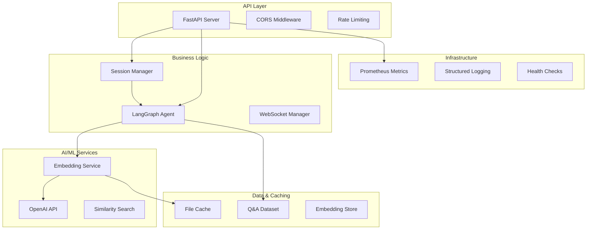

# Backend - DeFi Q&A Bot

A production-ready FastAPI backend with LangGraph orchestration, real-time WebSocket streaming, and intelligent semantic search capabilities.

## 🏗️ Architecture Overview

### System Architecture



### Key Components

#### 1. LangGraph Agent System
- **File**: `agents/defi_qa_agent.py`, `agents/async_defi_qa_agent.py`
- **Purpose**: Intelligent question processing and workflow orchestration
- **Features**: Graph-based node processing, error handling, streaming responses

#### 2. Session Management
- **File**: `services/session_manager.py`
- **Purpose**: Request isolation and concurrent user handling
- **Features**: Session-scoped agent instances, automatic cleanup, performance tracking

#### 3. WebSocket Manager
- **File**: `infrastructure/websocket_manager.py`
- **Purpose**: Real-time bidirectional communication
- **Features**: Connection lifecycle, message type handling, heartbeat monitoring

#### 4. Embedding Service
- **File**: `services/embedding_service.py`, `services/async_embedding_service.py`
- **Purpose**: Semantic search and similarity computation
- **Features**: Async embedding computation, cosine similarity, batch processing

#### 5. Cache Manager
- **File**: `services/cache_manager.py`
- **Purpose**: Performance optimization through intelligent caching
- **Features**: SHA256-based cache keys, automatic expiration, integrity checking

#### 6. Monitoring System
- **File**: `infrastructure/monitoring.py`
- **Purpose**: Production-ready observability and alerting
- **Features**: Prometheus metrics, real-time dashboard, error tracking

## 🚀 Quick Start

### Prerequisites
- Python 3.11+
- OpenAI API Key

### Setup
```bash
# Create virtual environment
python -m venv env
source env/bin/activate  # Windows: env\Scripts\activate

# Install dependencies
pip install -r requirements.txt

# Environment configuration
cp environment_template.txt .env
# Edit .env with your OPENAI_API_KEY
```

### Run Development Server
```bash
python -m uvicorn main:app --reload --host 0.0.0.0 --port 8000
```

### Environment Variables

#### Required
```env
OPENAI_API_KEY=your_openai_api_key_here
```

#### Development Settings
```env
ENVIRONMENT=development
DEBUG=true
HOST=127.0.0.1
PORT=8000
RELOAD=true
LOG_LEVEL=DEBUG
```

#### Production Settings
```env
ENVIRONMENT=production
DEBUG=false
ALLOWED_ORIGINS=https://your-domain.com
RATE_LIMIT_REQUESTS_PER_MINUTE=200
```

#### Full Configuration
See `environment_template.txt` for all available options.

## 📡 API Reference

### Base URL
- **Development**: `http://localhost:8000`
- **Production**: `https://your-domain.com`

### Core Endpoints

#### Health Check
```http
GET /health
```
**Response:**
```json
{
  "status": "healthy",
  "agent_loaded": true,
  "message": "DeFi Q&A Bot is running and ready to answer questions"
}
```

#### Basic Question (V1)
```http
POST /ask
Content-Type: application/json

{
  "question": "What is impermanent loss in DeFi?"
}
```
**Response:**
```json
{
  "answer": "Impermanent loss occurs when...",
  "confidence": 0.87,
  "processing_stage": "response_complete",
  "error": null,
  "session_id": null
}
```

#### Streaming Question (V1)
```http
POST /ask-stream
Content-Type: application/json

{
  "question": "How does Compound work?"
}
```
**Response:** Server-Sent Events
```
data: {"type": "word", "content": "Compound", "confidence": 0.85}
data: {"type": "word", "content": "uses", "confidence": 0.85}
data: {"type": "complete", "final_confidence": 0.85}
```

#### Session-Managed Question (V2)
```http
POST /v2/ask
Content-Type: application/json

{
  "question": "What are the risks of yield farming?"
}
```
**Response:**
```json
{
  "answer": "Yield farming risks include...",
  "confidence": 0.92,
  "processing_stage": "response_complete",
  "error": null,
  "session_id": "session_abc123def456"
}
```

#### WebSocket API
```javascript
// Connect to WebSocket
const ws = new WebSocket('ws://localhost:8000/ws/ask');

// Send question
ws.send(JSON.stringify({
  type: 'question',
  question: 'What is MEV?'
}));

// Receive streaming response
ws.onmessage = (event) => {
  const message = JSON.parse(event.data);
  // Handle: word, metadata, complete, or error messages
};
```

### Monitoring Endpoints

#### System Metrics
```http
GET /metrics
```
Prometheus format metrics for monitoring systems.

#### Performance Dashboard
```http
GET /dashboard
```
Real-time HTML dashboard with system status and metrics.

#### Health Status (Detailed)
```http
GET /health-status
```
**Response:**
```json
{
  "status": "healthy",
  "components": {
    "agent": "healthy",
    "embeddings": "healthy",
    "cache": "healthy"
  },
  "metrics": {
    "active_sessions": 5,
    "cache_hit_rate": 0.78,
    "avg_response_time": 1.2
  }
}
```

#### System Metrics (JSON)
```http
GET /system-metrics
```
Detailed system resource usage and performance metrics.

### Response Formats

#### Standard Response
```json
{
  "answer": "string",
  "confidence": 0.85,
  "processing_stage": "response_complete",
  "error": null,
  "session_id": "string"
}
```

#### Streaming Response Types
- **word**: `{"type": "word", "content": "token", "confidence": 0.85}`
- **metadata**: `{"type": "metadata", "session_id": "abc", "total_words": 45}`
- **complete**: `{"type": "complete", "final_confidence": 0.85}`
- **error**: `{"type": "error", "message": "Error description"}`

#### Error Response
```json
{
  "detail": "Error description",
  "type": "validation_error",
  "code": 422
}
```

### Rate Limiting
- **Default**: 200 requests per minute per IP
- **Headers**: `X-RateLimit-Limit`, `X-RateLimit-Remaining`, `X-RateLimit-Reset`
- **Status Code**: 429 Too Many Requests

## 🛠️ Development

### Project Structure
```
backend/
├── main.py                    # FastAPI application entry point
├── config.py                  # Configuration management
├── requirements.txt           # Python dependencies
├── environment_template.txt   # Environment variables template
│
├── agents/                    # LangGraph agents
│   ├── __init__.py
│   ├── defi_qa_agent.py      # Synchronous agent
│   └── async_defi_qa_agent.py # Asynchronous agent
│
├── services/                  # Business logic services
│   ├── __init__.py
│   ├── embedding_service.py   # OpenAI embedding integration
│   ├── async_embedding_service.py
│   ├── cache_manager.py       # Intelligent caching
│   ├── dataset_loader.py      # Q&A dataset management
│   └── session_manager.py     # Session management
│
├── infrastructure/            # Infrastructure components
│   ├── __init__.py
│   ├── websocket_manager.py   # WebSocket handling
│   ├── monitoring.py          # Prometheus metrics
│   ├── logging_config.py      # Structured logging
│   └── error_handlers.py      # Error handling
│
├── middleware/                # Custom middleware
│   └── __init__.py
│
├── tests/                     # Test suite
│   ├── __init__.py
│   ├── test_api.py           # API endpoint tests
│   ├── test_integration.py   # Integration tests
│   ├── test_enhanced_agent.py # Agent tests
│   └── test_streaming.py     # Streaming tests
│
├── docs/                     # Technical documentation
│   ├── __init__.py
│   ├── websocket_fix_readme.md
│   ├── session_management_strategy.md
│   ├── async_programming_analysis.md
│   └── environment_config.md
│
├── cache/                    # Cached embeddings
└── logs/                    # Application logs
```

### Running Tests

#### Unit & Integration Tests
```bash
# All unit/integration tests
python -m pytest tests/ -v

# Specific test files
python -m pytest tests/test_api.py -v
python -m pytest tests/test_integration.py -v
python -m pytest tests/test_enhanced_agent.py -v
```

#### End-to-End (E2E) Tests
```bash
# Production readiness and deployment validation
cd tests/e2e

# Deployment validation
python test_deployment.py

# Concurrency & thread safety
python test_thread_safety.py

# Error handling scenarios
python test_error_handling.py

# WebSocket functionality
python test_websocket_client.py
```

See `tests/e2e/README.md` for comprehensive E2E testing documentation.

### Code Quality
```bash
# Format code
black . --line-length 88

# Lint code
flake8 . --max-line-length=88

# Type checking
mypy . --ignore-missing-imports
```

### Adding New Features

#### 1. Create New Agent Node
```python
# agents/custom_agent.py
from langgraph import Graph

def create_custom_node():
    def process(state):
        # Custom processing logic
        return {"result": "processed"}
    return process

# Add to graph in defi_qa_agent.py
```

#### 2. Add New Service
```python
# services/new_service.py
class NewService:
    def __init__(self):
        pass
    
    async def process(self, data):
        # Service logic
        return result
```

#### 3. Add New Endpoint
```python
# main.py
@app.post("/new-endpoint")
async def new_endpoint(request: RequestModel):
    # Endpoint logic
    return response
```

## 🔧 Configuration

### Environment Configuration

The application uses environment variables for configuration. Create a `.env` file based on `environment_template.txt`:

#### Core Settings
```env
# Required
OPENAI_API_KEY=your_api_key

# Environment
ENVIRONMENT=development  # development/staging/production
DEBUG=true
HOST=127.0.0.1
PORT=8000
```

#### Performance Settings
```env
# Rate Limiting
RATE_LIMIT_REQUESTS_PER_MINUTE=200
RATE_LIMIT_WINDOW_SECONDS=60

# Agent Configuration
AGENT_SIMILARITY_THRESHOLD=0.6
AGENT_MAX_RESULTS=5
AGENT_CACHE_ENABLED=true

# Caching
CACHE_ENABLED=true
CACHE_MAX_SIZE=1000
CACHE_EXPIRY_DAYS=30
```

#### Security Settings
```env
# CORS
ALLOWED_ORIGINS=http://localhost:3000,https://your-domain.com

# Security
SECRET_KEY=your-secret-key
USE_HTTPS=false  # Set to true in production
```

#### Logging Settings
```env
# Logging
LOG_LEVEL=INFO  # DEBUG/INFO/WARNING/ERROR
ENABLE_CONSOLE_LOGS=true
LOG_DIR=logs
```

See `environment_template.txt` for the complete list of configuration options.

## 📊 Monitoring & Observability

### Metrics Collection
The application collects comprehensive metrics via Prometheus:

- **HTTP Metrics**: Request duration, status codes, endpoint usage
- **WebSocket Metrics**: Connection count, message rates
- **Agent Metrics**: Processing time, confidence scores
- **System Metrics**: Memory usage, CPU utilization
- **Cache Metrics**: Hit rate, size, operations

### Dashboard
Access the real-time monitoring dashboard at `/dashboard`:
- System health overview
- Performance graphs
- Active connections
- Error rates
- Resource utilization

### Logging
Structured JSON logging with:
- Request/response correlation IDs
- Performance metrics
- Error tracking with stack traces
- User session tracking

### Health Checks
Multiple health check endpoints:
- `/health`: Basic health status
- `/health-status`: Detailed component health
- `/system-metrics`: System resource metrics
- `/performance-stats`: Performance statistics

## 🚀 Deployment

### Docker
```bash
# Build image
docker build -t defi-qa-bot .

# Run container
docker run -p 8000:8000 \
  -e OPENAI_API_KEY="your-key" \
  -e ENVIRONMENT="production" \
  defi-qa-bot
```

### Cloud Platforms
The backend is configured for deployment on:
- **Heroku**: `Procfile` configuration
- **Railway**: `railway.toml` configuration  
- **Render**: `render.yaml` configuration
- **Vercel**: `vercel.json` configuration

### Production Checklist
- [ ] Set `ENVIRONMENT=production`
- [ ] Set `DEBUG=false`
- [ ] Configure `ALLOWED_ORIGINS`
- [ ] Set up SSL/HTTPS
- [ ] Configure rate limiting
- [ ] Set up monitoring alerts
- [ ] Configure log aggregation

## 🔒 Security

### Configuration Security
- Environment-based secrets management
- No hardcoded API keys or credentials
- Secure CORS configuration
- Rate limiting protection

### API Security
- Input validation with Pydantic models
- SQL injection prevention (no direct SQL)
- XSS protection through proper response handling
- HTTPS enforcement in production

### Error Handling
- Sanitized error messages (no sensitive data exposure)
- Structured error responses
- Comprehensive logging for debugging
- Graceful degradation

## 🧪 Testing

### Test Categories

#### Unit Tests (`tests/`)
- API endpoint testing
- Service layer testing
- Agent functionality testing
- Utility function testing

#### Integration Tests
- End-to-end API workflows
- WebSocket communication
- Agent processing pipelines
- Error handling scenarios

#### Performance Tests
- Load testing with multiple concurrent users
- Memory usage monitoring
- Response time benchmarking
- Rate limiting validation

### Running Tests
```bash
# Unit tests
python -m pytest tests/ -v --cov=.

# Integration tests  
python test_integration.py
python test_api.py

# Performance tests
python test_thread_safety.py
python test_websocket_client.py
```

### Test Coverage
Maintain >90% test coverage across:
- API endpoints
- Business logic services
- Error handling paths
- Configuration management

## 📚 Additional Documentation

- **Session Management**: `docs/session_management_strategy.md`
- **WebSocket Implementation**: `docs/websocket_fix_readme.md`
- **Async Programming**: `docs/async_programming_analysis.md`
- **Environment Configuration**: `docs/environment_config.md`
- **Error Handling**: `docs/error_analysis.md`

## 🤝 Contributing

### Development Workflow
1. Create feature branch
2. Implement changes with tests
3. Ensure test coverage >90%
4. Run code quality checks
5. Submit pull request

### Code Standards
- **Style**: Black formatting, line length 88
- **Linting**: Flake8 compliance
- **Type Hints**: Full type annotation
- **Documentation**: Docstrings for all public functions
- **Testing**: Unit tests for new features

---

**For general project information, see the main [README.md](../README.md)** 